AI & Data Science student at Amrita Vishwa Vidyapeetham. I like taking models out of notebooks and putting them somewhere they have to actually work: a pipeline, an API, a page real people load. My focus is **computer vision**, image pipelines, model training, and the unglamorous data-cleaning work that decides whether any of it holds up outside a demo.

Reach me: [vedangps@gmail.com](mailto:vedangps@gmail.com) · [GitHub](https://github.com/vedangps)

## 🛠️ Tech stack

#### 💻 Languages

 

#### 🤖 AI · Machine Learning · Data Science

    

#### 🌐 Web Development

 

#### 🚀 Deployment & Tooling

 

#### 📓 Platforms

  

**Recent activity:**

<!--START_SECTION:activity-->
<!--END_SECTION:activity-->

